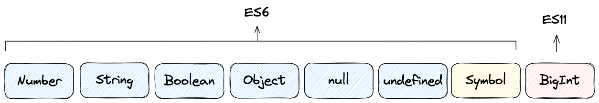
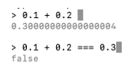
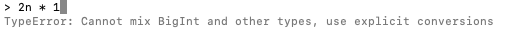
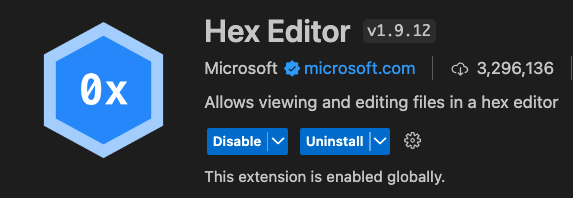

## 데이터 타입

### JavaScript 타입



### Number 타입

- Number 타입은 정수와 소수를 모두 포함한다. 그리고 `배정밀도 64비트 부동소수점 형식`(??)을 따른다.
- `배정밀도 64 비트 부동소수점 형식`을 따른다는 것은 10진수 숫자를 2진수로 변환하고 64 비트 형식으로 메모리에 저장된다는 것이다. 64 비트로 표현되는 값은 정밀도에서 한계가 있다. 이 형식에 맞추다보면 때로는 정확한 숫자가 아닌 근사치의 값으로 변환되어진다.
- 아래 사진은 Node REPL에서 테스트 해 본 것이다. 0.1 + 0.2가 0.3이 아니라니.. 이걸 아직까지 몰랐다니..

  

### BigInt 타입

- BigInt 타입은 아주 큰 숫자를 표현하거나 Number를 사용할 때보다 더 정밀함이 요구되는 경우 사용된다. ES11에서 추가되었다.
- 긴 ID값이나 타임스탬프 값을 더 정밀하게 다루는 연산에서 사용되는 경우들이 있다고 한다.
- 아래 사진처럼 BigInt 타입은 Number 타입과 연산을 할 수 없고 TypeError가 발생한다. BigInt 숫자끼리만 산술 연산이 가능하다.

  

### String 타입

- 문자열을 다루면서 줄바꿈을 표한할 때 옛날 프린터의 동작 방식에서 따온 용어들이 있다.

  - 라인 피드(LF): 커서 정지한 상태에서 종이를 올려 한줄 이동
  - 캐리지 리턴(CR): 커서 맨 앞으로 이동, 종이는 움직이지 않음

  

- VS Code 어디선가 CRLF와 LF를 본 기억이 있었다.

  

  - 하단 오른쪽 상태 표시줄에서 Line Sequence를 LF 또는 CRLF로 변경할 수 있다. 바꿔도 차이가 눈으로 보이지 않는다. 하지만 16진수로 파일을 확인하면 줄바꿈 부분에서 차이가 있다.

  

  - `Hex Editor` VS Code Extension을 설치 후 파일을 열어보면 LF일 때는 줄바꿈이 `0A` (라인 피드 LF)로 표현되고 CRLF일 때는 `0D 0A` (캐리지 리턴 CR + 라인 피드 LF)로 표현된 것을 확인할 수 있다.

### undefined 타입

- 면접에서 undefined와 null의 차이가 무엇인지 질문을 받은적이 있다.
- undefined는 변수가 선언되었지만 아직 아무값도 할당되지 않은 값이고 null은 프로그래머가 명시적으로 아무것도 없음을 할당해준 값이다.
- var로 선언된 변수는 자바스크립트 엔진이 평가 단계에서 메모리에 undefined를 할당한다. let, const로 선언된 변수는 할당 이전에는 TDZ에 있어서 참조가 불가하다.
- 책에서는 프로그래머가 변수에 undefined를 직접 할당하는 것은 본래 undefined의 취지와 다르기 때문에 권장하지 않고 null 사용을 권장한다. (오 새로운 사실!)

### Symbol 타입

- 다른 값과 중복되지 않는 유일무이한 값을 표현하기 위한 데이터의 타입
- 주로 객체의 프로퍼티 키를 유일한 값으로 하기 위해 사용된다
- Symbol() 함수로 생성한다
  ```javascript
  const key = Symbol("key");
  ```
- 자세한 내용은 33장에서 나온다고 해서 정확한 사용 케이스는 모르지만 넘어가기로 했다

### 데이터 타입이 필요한 이유

- 자바스크립트 엔진은 타입 종류에 따라 정해진 크기의 메모리 공간을 확보하고 불러올 때도 그 크기만큼만을 불러온다.
- 타입에 따라 메모리에 저장된 비트값이 다르게 해석된다. 8비트 `0100 0001`은 String 타입으로는 'A', Number 타입으로는 65로 해석된다.

### 정적 타입 언어 & 동적 타입 언어

- C 언어 같은 정적 타입 언어는 변수 선언시 타입을 기본적으로 지정하며 컴파일 타임에 타입 체크를 실시한다.
- JavaScript는 동적 타입 언어이고 변수 선언시 타입 선언을 하지 않는다. 어떠한 타입의 값이라도 동적으로 할당될 수 있다. 선언할 때가 아닌 할당시 변수의 타입이 결정된다.
- 숫자 타입 문자 타입이 잘 못 지정되어 오류가 나타나는 경우가 종종 있다고 한다.
- 변수에 어떤 타입의 데이터가 할당될지 미리 선언하여 정적 타입 언어처럼 사용할 수 있도록 타입스크립트를 많이 사용한다.

## 연산자

- 산술 연산자
  - 수학적 계산을 한다. 연산이 불가한 경우에는 `NaN`(Not a Number)를 반환한다.
  - 단항 산술 연산자
    - `++`, `--` 연산자는 부수효과가 있다. `prefix`로 연산자가 붙는지 `postfix`로 연산자가 붙는지에 따라 부수효과의 시점이 다르게 동작한다.
      ```javascript
      // Postfix ++
      let a = 1;
      const b = a++;
      // a = 2, b = 1
      // b에 a를 할당 > a 값 1 증가
      ```
      ```javascript
      // Prefix ++
      let a = 1;
      const b = ++a;
      // a = 2, b = 2
      // a 값 1 증가 > b에 a를 할당
      ```
  - 피연산자가 두개 중 하나가 문자열이면 문자열 연결 연산자로 동작한다.
    ```javascript
    "1" + 2; // '12'
    ```
- 비교 연산자

  - 동등 연산자(`==`)는 값이 같은지 비교하지만 타입이 같은지는 비교하지 않는다
  - 일치 연산자(`===`)는 값과 타입이 모두 같은지 좀 더 엄격한 비교를 한다
  - 비교시 동등 연산자보다는 일치 연산자(`===`)을 사용하는 것이 좋다
  - `NaN` 여부를 확인할 때는 `Number.isNaN()` 함수를 사용한다
  - `Object.is()` 메서드 사용시 `===`을 사용했을 때와 다른 경우가 있다.

    ```javascript
    // === 로 값 비교
    +0 === -0; // true
    NaN === NaN; // false

    // Object.is() 로 값 비교
    Object.is(+0, -0); // false
    Object.is(NaN, NaN); // true
    ```

  - 삼항 연산자

    - 삼항 연산자 자체를 값으로 평가할 수 있어 유용하다
      ```javascript
      const result = a > b ? "a가 b보다 크다" : "a가 b보다 크지 않다";
      ```

  - 논리 연산자

    - 드모르간의 법칙을 이용하여 논리 연산자 표현식의 가독성을 개선할 수 있다
      ```javascript
      !(a || y) === !a && !b;
      ```

  - typeof 연산자

    - typeof null은 object를 반환한다. 자바스크립트의 버그이지만 현재까지 작성된 수많은 자바스크립트 코드들에 영향을 미치기 때문에 수정되지 못하고 있다. (면접에서 질문 받아본 적이 있다. 콘솔에 안찍어봐서 모르겠다고 했었다 ㅋㅋ)

  - 지수 연산자

    ```javascript
    // ** 지수 연산자는 ES7에 도입되었다
    2 ** 2;
    // 이전에는 이렇게 지수 연산을 했었다
    Math.pow(2, 2);

    // 지수연산자의 피연산자가 음수일 때는 꼭 괄호를 붙여야한다. 그렇지 않으면 SyntaxError가 발생한다
    -2 ** 2;
    // 정상 동작
    (-2) ** 2;

    // 할당 연산자와 함께 사용 가능
    let number = 2;
    number **= 2
    ```

  - 그 외의 연산자
    - ?. > 옵셔널 체이닝
    - ?? > null 병합 연산자 (영어로는 nullish coalescing operator..)
    - delete > 프로퍼티 삭제
    - new > 생성자 함수 호출할 때, 인스턴스 생성
    - instanceof > 좌변의 인스턴스가 우변 생성자 함수의 인스턴스인지 판별
    - in > 프로퍼티 존재 확인

## 1주차 정리 회고

- 감기가 걸려 앓아누워서 준비를 못하다가 급하게 정리하느라 퀄리티가 괜찮은지 모르겠습니다. 처음에는 이미지 같은 것들을 넣어보다가 나중에는 힘들어서 못했습니다.. 다음에는 좀 더 잘 정리하고 좀 더 잘 전달하도록 하겠습니다.
- `모던 자바스크립트 Deep Dive` 이 책 정말 좋은 것 같습니다. 이 책을 더 빨리 접했더라면 얼마나 좋았을까하는 생각이 들었고 지금이라도 접하게되어 다행입니다. 기술 면접 볼 때 유용할 것 같습니다. 새롭게 배우는 내용들이 많아서 매우 좋았습니다. 앞으로 커뮤니케이션 할 때 더 보편적인 단어들을 사용할 수 있을 것 같습니다.
- 혼자 읽었으면 꾸준함이 떨어졌을텐데 스터디 참여하기 잘했다는 생각이 들었습니다.
