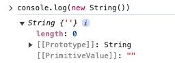
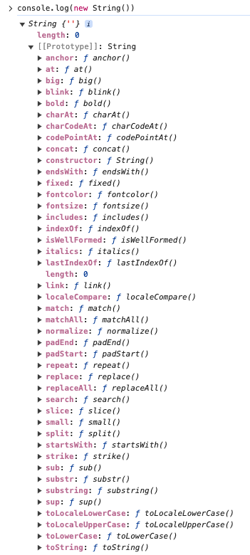
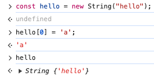

### 목차

- 32장 String
- 33장 Symbol

### 32장 String

#### 32.1 String 생성자 함수

- 표준 빌트인 객체 String은 유용한 프로퍼티와 메서드를 제공한다.

#### new String() / 생성자 함수

- new 연산자를 붙인 생성자 함수 new String()으로 String 래퍼 객체 인스턴스를 생성할 수 있다.

- 브라우저 출력

  - 아무 인자 없이 new String()을 호출하면 [[StringData]] 값에 빈 문자열을 할당한 String 래퍼 객체를 생성한다 (래퍼 객체는 String 원시 타입 값을 마치 객체처럼 사용하도록 해주는 객체이다 21.3장 참조)

    

  - 브라우저 출력 결과물을 확인하면 [[Prototype]]과 [[PrimitiveValue]]를 확인할 수 있다

    

  - [[Prototype]]을 펼치면 사용할 수 있는 여러 메서드들과 length 프로퍼티를 볼 수 있다

  - String 객체는 [[StringData]]값을 생성하고 Number 객체는 [[NumberData]]값을 생성한다. 두 경우 모두 브라우저에서 출력해보면 이들을 참조하고 있는 [[PrimitiveValue]]값을 출력한다.

- 유사 배열 객체

  - new String으로 생성된 String 래퍼 객체는 length 값을 가지고 각 문자를 index로 참조할 수 있는 유사 배열 객체이다.

    - 예) const str = new String("Hello"); // str[0]은 H, str.length는 5
    - 단 원시값으로 취급되어 값을 변경할 수 없다 str[0] = "A" 를 하더라도 str은 "Hello"

      

- 문자열이 아닌 값을 인자로 넘겼을 때
  - new String(123)이나 new String(null)처럼 문자열이 아닌 값을 인자로 넘기게 되면 이를 문자열로 강제 변환하여 String 래퍼 객체에 값을 할당한다

#### String() / 명시적 타입 변환

- new 연산자 없이 사용하면 String 래퍼 객체 인스턴스가 생성되지 않고 일반 문자열을 반환한다. 명시적 타입 변환으로 많이 사용된다. // String(123) === "123"

### mutator method / accessor method

- 배열의 경우 mutator method와 accessor method 두 종류의 메서드를 가지는데 mutator는 원본 배열을 직접 변환시키는 메서드이고 accessor method는 새로운 배열을 생성하여 반환하는 메서드이다.
- 하지만 String은 배열과 다르게 원본을 직접 변경하는 mutator method를 가지지 않고 언제나 새로운 문자열을 반환한다. 문자열은 변경 불가능한 값이다(Immmutable) String 래퍼 객체도 Read only 읽기 전용 객체로 제공된다.

### 사용 빈도가 높은 String 메서드 리스트

- String.prototype.indexOf:
- String.prototype.search
- String.prototype.includes
- String.prototype.startsWith
- String.prototype.endsWith
- String.prototype.charAt
- String.prototype.substring
- String.prototype.slice
- String.prototype.toUpperCase
- String.prototype.toLowerCase
- String.prototype.trim
  - String.prototype.trimStart
  - String.prototype.trimEnd
- String.prototype.repeat
- String.prototype.replace
- String.prototype.split

- 리스트에서 개인적으로 많이 사용하는 것 같은 메서드
  - .split()
  - .includes()
- 가끔 쓰는 것들
  - .trim()
  - .toLowerCase(), .toUpperCase()
  - .charAt()
  - .indexOf()
  - .replace()
- 안써본 것들
  - .search()
  - .endsWith()
  - .trimStart(), .trimEnd
  - .repeat()

### 33장 Symbol

Symbol은 ES6에서 도입된 7번째 원시 타입이다. 다른 값과 중복되지 않는 유일한 값으로 사용된다. 프로퍼티 키 충돌 방지를 위해 사용된다고 한다. 프로퍼티 키로는 문자열과 심볼 값이 사용 가능하다. 아직까지는 심볼을 프로퍼티 키로 사용해본적이 없다.

- 심볼은 원시값이기 때문에 new를 사용하지 않는다. const newSymbol = Symbol();
- 인자로 description 문자열을 줄 수 있다. 하지만 디버깅 용으로만 사용되는 값이라고 한다. 예) const newSymbol = Symbol("newSymbol"); console.log(newSymbol.description); // newSymbol
- Symbol.for("mySymbol") 메서드로 global symbol registry의 심볼 값을 검색할 수 있다. Symbol.keyFor()로는 키값을 추출한다

- 자바스크립트에서 enum을 흉내내는 방법 (이렇게까지 하는 사람이 있을까..? 있다면 좀 대단한 것 같다)

```javascript
// 책 심볼 예시
const Direction = Object.freeze({
  UP: Symbol("up"),
  DOWN: Symbol("down"),
  LEFT: Symbol("left"),
  RIGHT: Symbol("right"),
});

// Object.freeze대신에 타입스크립트 as const를 쓰고 Symbol 대신 그냥 문자열로 할 것 같다.. 심볼의 장점이 특별히 느껴지진 않는다 코드에 신박한 느낌을 추가시켜주기는 하는 것 같다
const STATE = {
  LOADING: "loading",
  COMPLETE: "complete",
  FAIL: "fail",
} as const;
```

- 심볼의 활용

  - 심볼로 키를 정한 프로퍼티는 객체 프로퍼티 출력시 은닉할 수 있다. 하지만 심볼로 만든 프로퍼티를 확인할 수 있는 함수도 있다.(Object.getOwnPropertySymbols(obj))
  - 표준 빌트인 객체를 확장시킬 때 메소드 네이밍 충돌 예방을 위해 사용할 수 있다. 하지만 잘 만들어져있는 표준 빌트인 객체를 커스터마이징하는건 안하는게 좋은 것 같다.

- Well known Symbol
  - 특정한 목적을 가진 내장된 심볼들이다
  - 제대로 이해했는지 모르겠지만.. ECMA 사양에 맞는 객체를 만들고 싶다면 알맞은 Well known Symbol을 프로퍼티로 갖게하면 된다. 예)이터러블을 규정을 지키는 객체 만들기 > Symbol.iterator 프로퍼티 갖게하기
