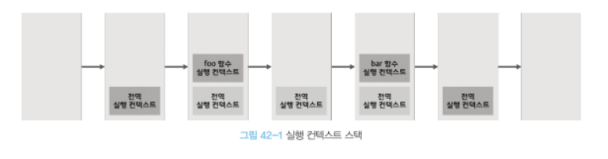
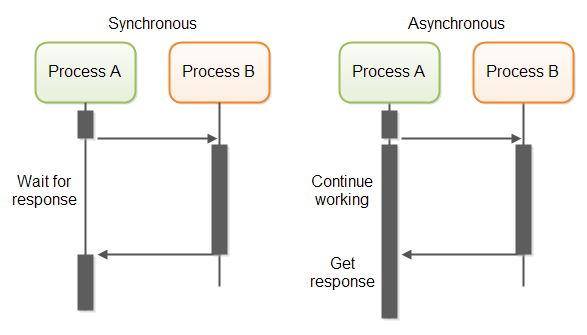

### 목차

- Set
- Map
- 비동기 프로그래밍

---

### Set

- Set 객체는 중복되지 않는 값들의 집합
- 배열과 비슷하지만 차이가 있다
- 수학에서의 집합을 구현한 자료구조이다

### Set과 배열의 차이

- Set은 중복을 포함할 수 없다
- Set은 요소 순서에 의미가 없다
- Set은 인덱스로 요소에 접근할 수 없다

### Set 객체 생성 방법

- Set 생성시 이터러블의 중복은 제거된다
- `const set = new Set([1, 2, 3, 3]); // Set(3) { 1, 2, 3 }`
- `const set = new Set("hello"); // Set(4) { "h", "e", "l", "o" }`

### 배열 요소 중복 제거 함수 구현 (배열, Set)

- Set을 이용한 함수 구현이 가독성이 더 좋다
- `const unique = (array) => array.filter((element, index, array) => array.indexOf(element) === index);`
- `const unique = (array) => [...new Set(array)];`

### Set 객체 스펙

- 요소 개수: `set.size // number 반환`
- 요소 추가: `set.add(1)`
- 요소 삭제: `set.delete(1) // 삭제 성공 여부 boolean`
- 요소 전체 삭제: `set.clear() // Set(0) {}로 변경`
- 요소 포함 여부: `set.has(1) // 포함 여부 boolean 반환`
- 요소 순회: `set.forEach((value, value2, set) => {});`

### Set 집합 연산

- 교집합, 합집합, 차집합, 부분 집합, 상위 집합을 직접 함수로 함수로 구현하여 프로토타입에 추가한 것을 책에서 볼 수 있다
- MDN에 Set 프로토타입으로 교집합 합집합 차집합 등이 있지만 현재 일부 브라우저에서만 동작하기 때문에 사용할 수 없다.
- https://developer.mozilla.org/en-US/docs/Web/JavaScript/Reference/Global_Objects/Set/intersection#browser_compatibility

---

### Map

- Key, Value로 이루어진 컬렉션이다
- 객체와 유사하지만 차이가 있다

### Map 객체와 객체의 차이

- Key로 사용할 수 있는 값의 범위가 다르다 (객체: 문자열, 심볼 / Map 객체: 객체를 포함한 모든 값)
- Map은 이터러블이고 객체는 이터러블이 아니다
- Map의 요소 개수 확인 방법이 더 간결하다 (객체: `Object.keys(object).length` / Map 객체: `map.size`)

### Map 객체 생성 방법

- `const map = new Map([['key1', 'value1'], ['key2', 'value2']]); // Map(2) { "key1" => "value1", "key2" => "value2" }`
- 중복된 키는 덮어씌어진다

### Map 스펙

- 요소 추가: `map.set('key', 'value');`
- 요소 취득: `map.get('key');`
- 요소 포함 확인: `map.has('key');`
- 요소 제거: `map.delete('key');`
- 요소 전체 삭제: `map.clear();`

### 그 밖의 Map 프로토타입

- Map.prototype.forEach()
- Map.prototype.keys()
- Map.prototype.values()
- Map.prototype.entries()

---

### 비동기 프로그래밍

- 작업 완료를 대기하지 않고 다른 작업을 수행하는 프로그래밍 패러다임
- 콜백 함수, 프로미스, async/await 들을 사용하여 비동기 작업을 처리하는 방식
- 네트워크 요청, I/O 작업 처리에 유용하게 사용된다

### 실행 컨텍스트 스택 진행 흐름

- 함수는 실행 컨텍스트 스택의 푸쉬 팝 순서에 따라 실행된다

```javascript
const foo = () => {};
const bar = () => {};

foo();
bar();
```



### 동기 처리

- 실행 컨텍스트 스택을 보면 함수는 동시에 실행되지 않고 하나씩 싱행된다 (싱글 스레드)
- 시간이 걸리는 함수가 있으면 블로킹이 발생하고 이를 기다리는 것이 동기 처리이다
- 동기 처리는 실행 순서가 보장되는 장점과 이후 태스크들은 대기해야한다는 단점을 가지고 있다

### 비동기 처리

- setTimeout의 콜백 함수는 실행 완료될 때까지 다른 작업들을 블로킹하지 않는다
- 함수 실행이 완료되지 않아도 대기하지 않고 다음 함수를 실행하는 방식이 비동기 처리이다
- 비동기로 처리되는 함수 이후에 처리되어야하는 작업들을 보장하기 위해서는 콜백, 프로미스, async/await을 사용한다

### 동시성


- 자바스크립트 엔진은 싱글 스레드이다
- 브라우저는 멀티 스레드이다. 자바스크립트 엔진, 렌더링 엔진, Web API 등을 포함한다.
- 자바스크립트 엔진은 한번에 하나의 작업만 수행되는 싱글 스레드 방식이지만 자바스크립트 엔진은 브라우저의 일부분이고 자바스크립트 엔진이 수행하는 것이 아닌 작업들은 병행 진행될 수 있다. 때문에 setTimeout의 타이머 동작(브라우저 처리)이 진행되면서도 다른 함수들이 실행될 수 있다

### 자바스크립트 엔진 구성


- 콜 스택: 실행 컨텍스트 스택이며 최상위 실행 컨텍스트가 종료되기 전까지 다른 작업을 실행시키지 않는다
- 힙: 메모리 공간이며 여기에 보관된 객체들이 참조됭 사용된다
- 태스크 큐: 비동기 함수의 콜백 함수들, 이벤트 핸들러가 일시적으로 보관되는 큐이다 (프로미스의 후속 처리 콜백 함수가 저장되는 마이크로태스크 큐도 있다)
- 이벤트 루프: 콜스택에 실행 중인 실행 컨텍스트가 확인하고 태스큐에 대기 중인 함수가 있는지 반복적으로 확인한다. 그리고 콜스택이 비었고 태스크큐가 대기 중이면 함수를 콜스택으로 이동시킨다.

### 동기와 비동기의 차이 정리



- 동기는 하나의 타임라인만이 존재하고 이를 공유한다
- 비동기는 여러 타임라인이 있다고 볼 수 있다
